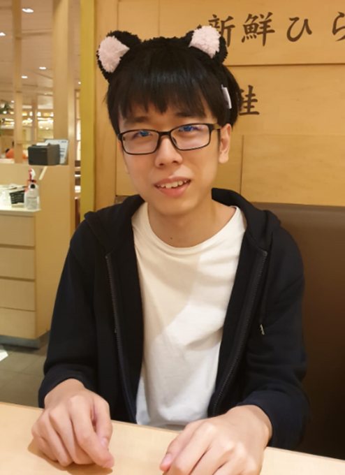
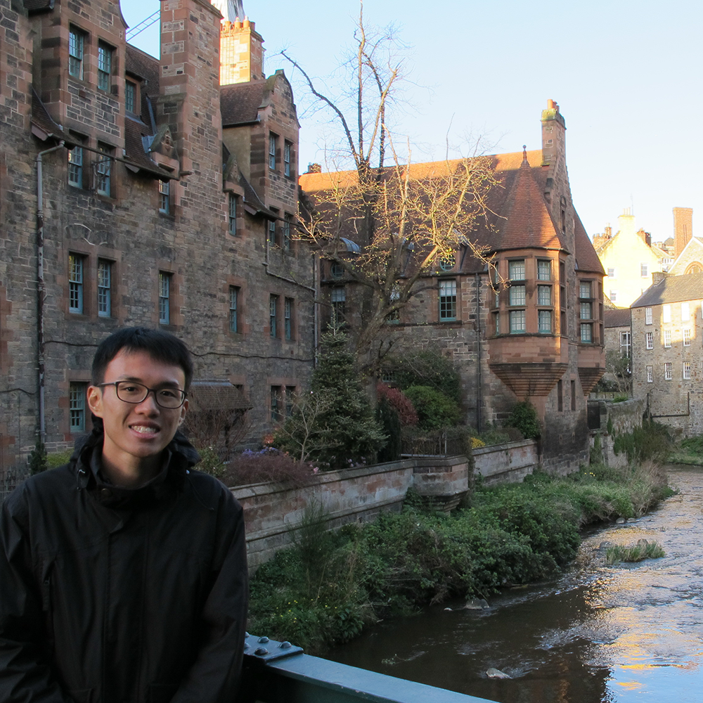

We are a team based in the [School of Computing, National University of Singapore](http://www.comp.nus.edu.sg).

## Project team

### Ng Yong Xiang

[[github](http://github.com/yongxiangng)]
[[portfolio](team/yongxiangng.md)]

- Role: Developer
- Responsibilities: Deliverables and deadlines

### Nguyen Quang Vinh

[[github](https://github.com/IceWizard4902)]
[[portfolio](team/icewizard4902.md)]

- Role: Developer
- Responsibilities: Testing

### Ng Zi Xuan

[[github](http://github.com/nzixuan)] [[portfolio](team/nzixuan.md)]

- Role: Developer
- Responsibilities: Data

### Ryan Ong

[[github](http://github.com/ryanongra)]
[[portfolio](team/ryanongra.md)]

- Role: Developer
- Responsibilities: Code Quality

### Tay Jun Yang

[[github](http://github.com/dannytayjy)]
[[portfolio](team/dannytayjy.md)]

- Role: Developer
- Responsibilities: UI
