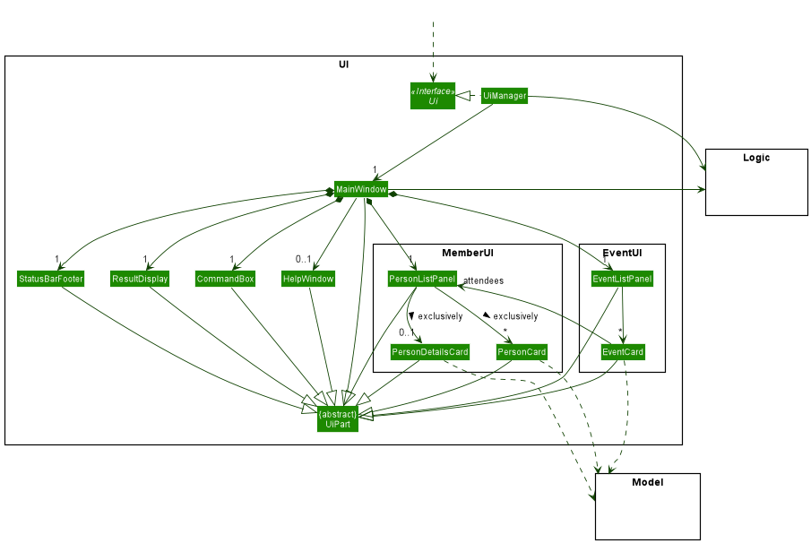
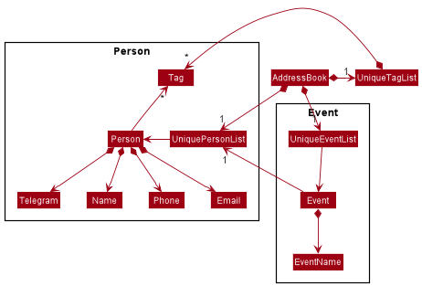

* Table of Contents
{:toc}

--------------------------------------------------------------------------------------------------------------------

## **Acknowledgements**

* {list here sources of all reused/adapted ideas, code, documentation, and third-party libraries -- include links to the original source as well}

--------------------------------------------------------------------------------------------------------------------

## **Setting up, getting started**

Refer to the guide [_Setting up and getting started_](SettingUp.md).

--------------------------------------------------------------------------------------------------------------------

## **Design**

:bulb: **Tip:** The `.puml` files used to create diagrams in this document can be found in the [diagrams](https://github.com/AY2122S1-CS2103-T16-4/tp/tree/master/docs/diagrams/) folder. Refer to the [_PlantUML Tutorial_ at se-edu/guides](https://se-education.org/guides/tutorials/plantUml.html) to learn how to create and edit diagrams.

### Architecture

The ***Architecture Diagram*** given above explains the high-level design of the App.

Given below is a quick overview of main components and how they interact with each other.

**Main components of the architecture**

**`Main`** has two classes called [`Main`](https://github.com/AY2122S1-CS2103-T16-4/tp/blob/master/src/main/java/seedu/address/Main.java) and [`MainApp`](https://github.com/AY2122S1-CS2103-T16-4/tp/blob/master/src/main/java/seedu/address/MainApp.java). It is responsible for,
* At app launch: Initializes the components in the correct sequence, and connects them up with each other.
* At shut down: Shuts down the components and invokes cleanup methods where necessary.

[**`Commons`**](#common-classes) represents a collection of classes used by multiple other components.

The rest of the App consists of four components.

* [**`UI`**](#ui-component): The UI of the App.
* [**`Logic`**](#logic-component): The command executor.
* [**`Model`**](#model-component): Holds the data of the App in memory.
* [**`Storage`**](#storage-component): Reads data from, and writes data to, the hard disk.

**How the architecture components interact with each other**

The *Sequence Diagram* below shows how the components interact with each other for the scenario where the user issues the command `delete 1`.

Each of the four main components (also shown in the diagram above),

* defines its *API* in an `interface` with the same name as the Component.
* implements its functionality using a concrete `{Component Name}Manager` class (which follows the corresponding API `interface` mentioned in the previous point.

For example, the `Logic` component defines its API in the `Logic.java` interface and implements its functionality using the `LogicManager.java` class which follows the `Logic` interface. Other components interact with a given component through its interface rather than the concrete class (reason: to prevent outside component's being coupled to the implementation of a component), as illustrated in the (partial) class diagram below.

The sections below give more details of each component.

### UI component

The **API** of this component is specified in [`Ui.java`](https://github.com/AY2122S1-CS2103-T16-4/tp/blob/master/src/main/java/seedu/address/ui/Ui.java)

The UI consists of a `MainWindow` that is made up of parts e.g.`CommandBox`, `ResultDisplay`, `StatusBarFooter` etc. All these, including the `MainWindow`, inherit from the abstract `UiPart` class which captures the commonalities between classes that represent parts of the visible GUI.

The `UI` component uses the JavaFx UI framework. The layout of these UI parts are defined in matching `.fxml` files that are in the `src/main/resources/view` folder. For example, the layout of the [`MainWindow`](https://github.com/AY2122S1-CS2103-T16-4/tp/blob/master/src/main/java/seedu/address/ui/MainWindow.java) is specified in [`MainWindow.fxml`](https://github.com/AY2122S1-CS2103-T16-4/tp/blob/master/src/main/resources/view/MainWindow.fxml)

The `UI` component,

* executes user commands using the `Logic` component.
* listens for changes to `Model` data so that the UI can be updated with the modified data.
* keeps a reference to the `Logic` component, because the `UI` relies on the `Logic` to execute commands.
* depends on some classes in the `Model` component, as it displays `Person` object and `Event` object residing in the `Model`.
* within the `PersonListPanel`, either `PersonCard` is displayed or `PersonDetailsCard` exclusively.
* the `PersonCard` and `PersonDetailsCard` depends on `Model`.
* within the `EventListPanel`, `EventCard` is displayed.
* the `EventCard` depends on `Model`.
* the `EventCard` also reuses `PersonListPanel` from the UI components related to the member tab, hence the association.

### Logic component

**API** : [`Logic.java`](https://github.com/AY2122S1-CS2103-T16-4/tp/blob/master/src/main/java/seedu/address/logic/Logic.java)

Here's a (partial) class diagram of the `Logic` component:

How the `Logic` component works:
1. When `Logic` is called upon to execute a command, it uses the `AddressBookParser` class to parse the user command.
1. This results in a `Command` object (more precisely, an object of one of its subclasses e.g., `AddCommand`) which is executed by the `LogicManager`.
1. The command can communicate with the `Model` when it is executed (e.g. to add a person).
1. The result of the command execution is encapsulated as a `CommandResult` object which is returned back from `Logic`.

The Sequence Diagram below illustrates the interactions within the `Logic` component for the `execute("delete 1")` API call.

:information_source: **Note:** The lifeline for `DeleteCommandParser` should end at the destroy marker (X) but due to a limitation of PlantUML, the lifeline reaches the end of diagram.

Here are the other classes in `Logic` (omitted from the class diagram above) that are used for parsing a user command:

How the parsing works:
* When called upon to parse a user command, the `AddressBookParser` class creates an `XYZCommandParser` (`XYZ` is a placeholder for the specific command name e.g., `AddCommandParser`) which uses the other classes shown above to parse the user command and create a `XYZCommand` object (e.g., `AddCommand`) which the `AddressBookParser` returns back as a `Command` object.
* All `XYZCommandParser` classes (e.g., `AddCommandParser`, `DeleteCommandParser`, ...) inherit from the `Parser` interface so that they can be treated similarly where possible e.g, during testing.

### Model component
**API** : [`Model.java`](https://github.com/AY2122S1-CS2103-T16-4/tp/blob/master/src/main/java/seedu/address/model/Model.java)

The `Model` component,

* stores the address book data i.e., all `Person` objects (which are contained in a `UniquePersonList` object) and all `Event` objects (which are contained in a `UniqueEventList` object).
* stores the currently 'selected' `Person` objects (e.g., results of a search query) as a separate _filtered_ list which is exposed to outsiders as an unmodifiable `ObservableList<Person>` that can be 'observed' e.g. the UI can be bound to this list so that the UI automatically updates when the data in the list change.
* stores the currently 'selected' `Event` objects (e.g., results of a search query) as a separate _filtered_ list which is exposed to outsiders as an unmodifiable `ObservableList<Event>` that can be 'observed' e.g. the UI can be bound to this list so that the UI automatically updates when the data in the list change.
* stores a `UserPref` object that represents the user’s preferences. This is exposed to the outside as a `ReadOnlyUserPref` objects.
* does not depend on any of the other three components (as the `Model` represents data entities of the domain, they should make sense on their own without depending on other components)
* the `Person` package contains classes related to the `Person` class.
* the `Person` class contains:
    * `Name`
    * `Phone`
    * `Telegram`
    * `Email`
    * `Tag`
* the `UniquePersonList` contains a unique list of `Person` objects.
* the `Event` package contains classes related to the `Event` class.
* the `Event` class contains:
    * `EventName`
    * `UniquePersonList` as the list of attendees
* the `UniqueEventList` contains a unique list of `Event` objects.

:information_source: **Note:** An alternative (arguably, a more OOP) model is given below. It has a `Tag` list in the `AddressBook`, which `Person` references. This allows `AddressBook` to only require one `Tag` object per unique tag, instead of each `Person` needing their own `Tag` objects. 

### Storage component

**API** : [`Storage.java`](https://github.com/AY2122S1-CS2103-T16-4/tp/blob/master/src/main/java/seedu/address/storage/Storage.java)

The `Storage` component,
* can save both address book data and user preference data in json format, and read them back into corresponding objects.
* inherits from both `AddressBookStorage` and `UserPrefStorage`, which means it can be treated as either one (if only the functionality of only one is needed).
* depends on some classes in the `Model` component (because the `Storage` component's job is to save/retrieve objects that belong to the `Model`)

### Common classes

Classes used by multiple components are in the `seedu.addressbook.commons` package.

--------------------------------------------------------------------------------------------------------------------

## **Implementation**

This section describes some noteworthy details on how certain features are implemented.

### Add feature (modification of existing feature)

#### Implementation Details

The `add` feature is implemented as a command such that it follows the flow of the `Logic` component as outlined above. The feature was modified to allow the user to omit non-essential details when adding a person (Phone, Telegram, Email, Tag(s)). These changes are reflected in the updated [Model Class Diagram](https://ay2122s1-cs2103-t16-4.github.io/tp/DeveloperGuide.html#model-component). This was done by taking the approach of using a unique unspecified input for omitted details. Through such an approach, the modification to existing code was minimised.

#### Design Considerations
Aspect: Ensuring that validation regex still valid.
* **Alternative 1 (current choice)**: Bypass the validation regex check since unspecified input does not require to be checked.
    * Pros: Does not require unnecessary modification of the validation regex. 
    * Cons: Requires an additional check for whether it is an unspecified input. This con was mitigated by extracting out the check to ensure code is SLAP and in a single level of abstraction.
    
* **Alternative 2**: Modify validation regex to match unspecified input string.
    * Pros: Does not require the additional lines of code, may be seen as a "cleaner" implementation.
    * Cons: Validation regex would become much more complex and unreadable. Also makes the code less extensible for other developers who may want to change the unspecified input string.

### Event feature

#### Implementation Details

The event feature is implemented in `AddressBook` by having `AddressBook` maintain a `UniqueEventList`. The implementation is similar to how `Person` is implemented in `AddressBook`. The relevant UI components then displays the events in an `EventCard` within the `EventListPanel`.

As a result, `AddressBook` now has the following additional methods.
* `setEvents(List<Events>)`
* `hasEvent(Event)`
* `addEvent(Event)`
* `setEvent(Event, Event)`
* `removeEvent(Event)`
* `clearAllEvents()`
* `getEventList()`

The `Model` interface now has the following additional methods.
* `hasEvent(Event)`
* `deleteEvent(Event)`
* `clearAllEvent()`
* `addEvent(Event)`
* `setEvent(Event, Event)`
* `getFilteredList()`
* `updateFilteredLisst(Predicate<Event>)`

The way `Event` behaves is very similar to `Person` and thus will be omitted to reduce repeated details.

#### Design considerations
Aspect: Whether to generify `UniqueEventList`:
* **Alternative 1 (current choice)**: Create a `UniqueEventList` class similar to `UniquePersonList`.
    * Pros: Easy to implement since there is already a reference. Can get code out fast.
    * Cons: Lots of boilerplate code

* **Alternative 2**: Generify `UniqueEventList` and `UniquePersonList`.
    * Pros: Much more elegant, extensible.
    * Cons: Needs major changes to existing code, risks regressions. Need to change multiple methods name like `setPerson` to `setItem`.

We have decided to go ahead with **Alternative 1** as it is easier to implement due to time constraints. Alternative 1 is likely to be more reliable as we do not risk running into regressions as much. While **Alternative 1** is less extensible, since we are only creating 1 more class of this type, the pros seems to outweigh the cons.

Aspect: Whether to generify `Name`, reuse `Name` or create `EventName`:
* **Alternative 1 (current choice)**: Create `EventName` class similar to `Name`.
    * Pros: Easy to implement, since we already have similar code. Less likely to introduce regressions.
    * Cons: More boilerplate code.

* **Alternative 2**: Reuse `Name` class.
    * Pros: Nothing to implement, lesser things to test.
    * Cons: Unable to have different type of valid name checking.

* **Alternative 3**: Make `Name` class generic, depending on the type of predicate used to test if name is valid.
    * Pros: Much more general. Lesser things to test, lesser bugs when done correctly.
    * Cons: Hard to implement. Over engineering.

We have decided to go ahead with **Alternative 1** as it allows for greater flexibility for future changes. The validity of an `EventName` does not have to follow that of `Name` and thus **Alternative 1** would be ideal for such a case. Moreover, using a different class allows for type checking, which ensures we do not accidentally pass a `Name` belonging to a `Person` to a method expecting `EventName` belonging to an `Event`.

### Chain commands feature

#### Implementation Details

The Chain Commands feature is implemented in `AddressBookParser` as a type of `Command` with similar implementations to how other commands are executed.

As such a new regex expression is created in `AddressBookParser` besides looking for the current `BASIC_COMMAND_FORMAT` and will search for commands with `ADVANCED_COMMAND_FORMAT`.

If a command matches the `ADVANCED_COMMAND_FORMAT` it will then parse the command into a `ChainCommand` which when executed will execute the two commands parsed into it.

The following sequence diagram shows how the Chain command parsing and execution works:

#### Design considerations
Aspect: How to parse inputs given to `ChainCommand`:
* **Alternative 1 (current choice)**: Handle the parsing of the inputs within `AddressBookParser` itself.
    * Pros: Easy to implement with no new classes created.
    * Cons: Creates an additional condition before basic commands are parsed. Making it difficult to trace the regular functioning of basic commands.

* **Alternative 2**: Use a `ChainCommandParser` and Command Words
    * Pros: The structure of how commands are usually executed is preserved, making code tracing easier to do.
    * Cons: Unable to parse the inputs of the ChainCommand without passing the current `AddressBookParser` object into the parser. Which will change the inputs of the `Parser`.

We have decided to go ahead with **Alternative 1** as it preserves the current implementation of the `Parser` and avoid having to pass around `AddressBookParser` objects during run time. While the code is modified instead of extended, we  believe that the alternative will cause even more modifications in the future resulting in futher problems.

### Clear feature improvements

#### Implementation details
As there are two separate lists (member and event list), we need a way to properly separate operations on either of the two list.

Hence, this calls for flags in the command. There are two flags in the `CliSyntax`: `-p` for person (member) and `-e` for event.
Also, there is a new Parser implemented for the `clear` command to check for the validity of the command as well as deciding which list the `clear` command should operate on.

The following sequence diagram shows how the `clear` command parsing and execution works:

#### Design considerations:
Aspect: How to clear entries in the given range
* **Alternative 1 (current choice)**: Reuse the `deletePerson` and `deleteEvent`. A loop is used in the `ClearCommand` from the ending index to the beginning index.
    * Pros: Easier to implement with no new methods introduced to the Model component. Furthermore, the two methods used are properly tested.
    * Cons: lengthy implementation (using loops)
* **Alternative 2**: Create two new methods `deleteAllPerson` and `deleteAllEvent` in Model to facilitate this enhancement.
    * Pros: A simpler, more direct way of implementing this enhancement. `ClearCommand` will simply call the appropriate command depending on the flag given.
    * Cons: Requires additional testing to ensure that the two new methods function correctly. There is also a possibility of the methods clashing with the implementation of the UI component.

### Save events to Json format

#### Implementation details
A new class `JsonAdaptedEvent` is implemented. The `JsonSerializableAddressBook` now stores both `JsonAdaptedPerson` and `JsonAdaptedEvent`
A `JsonAdaptedEvent` instance may contain multiple instances of `JsonAdaptedPerson`, which are the details of the members participating in that event.

#### Design considerations
Aspect: How to store the list of persons participating in a particular event
* **Alternative 1 (current choice)**: `JsonAdaptedEvent` will store a list of `JsonAdaptedPerson`
    * Pros: Easy to implement. This implementation is similar to how the `JsonSerializableAddressBook` stores `JsonAdaptedPerson` in AB3.
    * Cons: Overhead in data stored. Data of the same person may be repeated in the save file.
* **Alternative 2**: `JsonAdaptedEvent` will store the every index in the members' list of the members participating in the event
    * Pros: Less overhead in data stored
    * Cons: Updating the person list will require updates to every single entry in the event list since the index of every entry is changed. Furthermore, this implementation is very hard to test.

### \[Proposed\] Undo/redo feature

#### Proposed Implementation

The proposed undo/redo mechanism is facilitated by `VersionedAddressBook`. It extends `AddressBook` with an undo/redo history, stored internally as an `addressBookStateList` and `currentStatePointer`. Additionally, it implements the following operations:

* `VersionedAddressBook#commit()` — Saves the current address book state in its history.
* `VersionedAddressBook#undo()` — Restores the previous address book state from its history.
* `VersionedAddressBook#redo()` — Restores a previously undone address book state from its history.

These operations are exposed in the `Model` interface as `Model#commitAddressBook()`, `Model#undoAddressBook()` and `Model#redoAddressBook()` respectively.

Given below is an example usage scenario and how the undo/redo mechanism behaves at each step.

Step 1. The user launches the application for the first time. The `VersionedAddressBook` will be initialized with the initial address book state, and the `currentStatePointer` pointing to that single address book state.

Step 2. The user executes `delete 5` command to delete the 5th person in the address book. The `delete` command calls `Model#commitAddressBook()`, causing the modified state of the address book after the `delete 5` command executes to be saved in the `addressBookStateList`, and the `currentStatePointer` is shifted to the newly inserted address book state.

Step 3. The user executes `add n/David …​` to add a new person. The `add` command also calls `Model#commitAddressBook()`, causing another modified address book state to be saved into the `addressBookStateList`.

:information_source: **Note:** If a command fails its execution, it will not call `Model#commitAddressBook()`, so the address book state will not be saved into the `addressBookStateList`.

Step 4. The user now decides that adding the person was a mistake, and decides to undo that action by executing the `undo` command. The `undo` command will call `Model#undoAddressBook()`, which will shift the `currentStatePointer` once to the left, pointing it to the previous address book state, and restores the address book to that state.

:information_source: **Note:** If the `currentStatePointer` is at index 0, pointing to the initial AddressBook state, then there are no previous AddressBook states to restore. The `undo` command uses `Model#canUndoAddressBook()` to check if this is the case. If so, it will return an error to the user rather
than attempting to perform the undo.

The following sequence diagram shows how the undo operation works:

:information_source: **Note:** The lifeline for `UndoCommand` should end at the destroy marker (X) but due to a limitation of PlantUML, the lifeline reaches the end of diagram.

The `redo` command does the opposite — it calls `Model#redoAddressBook()`, which shifts the `currentStatePointer` once to the right, pointing to the previously undone state, and restores the address book to that state.

:information_source: **Note:** If the `currentStatePointer` is at index `addressBookStateList.size() - 1`, pointing to the latest address book state, then there are no undone AddressBook states to restore. The `redo` command uses `Model#canRedoAddressBook()` to check if this is the case. If so, it will return an error to the user rather than attempting to perform the redo.

Step 5. The user then decides to execute the command `list`. Commands that do not modify the address book, such as `list`, will usually not call `Model#commitAddressBook()`, `Model#undoAddressBook()` or `Model#redoAddressBook()`. Thus, the `addressBookStateList` remains unchanged.

Step 6. The user executes `clear`, which calls `Model#commitAddressBook()`. Since the `currentStatePointer` is not pointing at the end of the `addressBookStateList`, all address book states after the `currentStatePointer` will be purged. Reason: It no longer makes sense to redo the `add n/David …​` command. This is the behavior that most modern desktop applications follow.

The following activity diagram summarizes what happens when a user executes a new command:

#### Design considerations:

**Aspect: How undo & redo executes:**

* **Alternative 1 (current choice):** Saves the entire address book.
    * Pros: Easy to implement.
    * Cons: May have performance issues in terms of memory usage.

* **Alternative 2:** Individual command knows how to undo/redo by
  itself.
    * Pros: Will use less memory (e.g. for `delete`, just save the person being deleted).
    * Cons: We must ensure that the implementation of each individual command are correct.

_{more aspects and alternatives to be added}_

### \[Proposed\] Data archiving

_{Explain here how the data archiving feature will be implemented}_

--------------------------------------------------------------------------------------------------------------------

## **Documentation, logging, testing, configuration, dev-ops**

* [Documentation guide](Documentation.md)
* [Testing guide](Testing.md)
* [Logging guide](Logging.md)
* [Configuration guide](Configuration.md)
* [DevOps guide](DevOps.md)

--------------------------------------------------------------------------------------------------------------------

## **Appendix: Requirements**

### Product scope

**Target user profile**:

* has a need to manage a significant number of members for his CCA or interest group
* prefer desktop apps over other types
* can type fast
* prefers typing to mouse interactions
* is reasonably comfortable using CLI apps

**Value proposition**: manage members faster than a typical mouse/GUI driven app

### User stories

Priorities: High (must have) - `* * *`, Medium (nice to have) - `* *`, Low (unlikely to have) - `*`

| Priority | As a …​                                    | I want to …​                     | So that I can…​                                                        |
| -------- | ------------------------------------------ | ------------------------------ | ----------------------------------------------------------------------            |
| `* * *`  | user                                       | add new members with details   | track my members                                                                  |
| `* * *`  | user                                       | delete a member                | remove members who are not active anymore                                         |
| `* * *`  | user                                       | view a member's detail         |                                                                                   |
| `* * `   | first time user                             | easily find the details of available commands | learn new commands                                                  |
| `* * `   | first time user                             | easily populate the application with dummy data | try out features and see how the application is used             |
| `* * `   | first time user                             | easily clear all data          | remove unneeded data and start the application afresh                             |
| `* * `   | new user                                   | see new tip on features and commands | get to know the application better                                          |
| `* * `   | new user                                   | undo my commands               | easily undo mistakes                                                              |
| `* * `   | interest group leader                      | search and filter member        | find selected members easily                                                       |
| `*  `    | expert user                                | type commands in one line      | execute commands quickly                                                          |
| `*  `    | expert user                                | chain commands together and write macros | increase my productivity                                                |
| `*  `    | user                                       | tag an event or training session to a person | keep track of their attendance and contact them easily if they have not arrived |

### Use cases

(For all use cases below, the **System** is the `ForYourInterest` and the **Actor** is the `user`, unless specified otherwise)

**Use case: UC01 - Add a new member into the system**

**MSS**

1. User wants to add a new member.
2. User enters the details of the new member, which are name, phone number, telegram handle and email.
3. System confirms that the member is added.

   Use case ends.

**Extensions**

* 2a. System detects that the name is not entered.
    * 2a1. System requests for the name to be entered.
    * 2a2. User enters the name of the new member.
    * Step 2a1-2a2 are repeated until the name is entered.

* 2b. System detects that the phone number is not entered.
    * 2b1. System accepts that the phone number is not entered as it is optional.
    * Use case resumes at 2c.
* 2c. System detects that the telegram handle is not entered.
    * 2c1. System accepts that the telegram handle is not entered as it is optional.
    * Use case resumes at 2d.
* 2d. System detects that the email is not entered.
    * 2d1. System accepts that the email is not entered as it is optional.
    * Use case resumes at 3.

**Use case: UC02 - Delete a member from the system**

**MSS**

1. User searches for a member using <ins>UC04 - Find a member<ins/>.
2. User requests to delete the member.
3. System confirms that the member is deleted.

   Use case ends.

**Extensions**

* 2a. User attempts to delete a member that is not in the list.
    * 2a1. System notifies the user that the member is not in the list.

  Use case ends.

**Use case: UC03 - View all members managed by the system**

**MSS**

1. User requests to view all members managed by the system.
2. System shows a list of all members managed by the system.

   Use case ends.

**Use case: UC04 - Find a member**

**MSS**

1. User requests to find members with a given keyword.
2. Members with details matching the given keywords are shown in the same format as <ins>UC03 - View all members managed by the system<ins/>.

   Use case ends.

**Extensions**
* 1a. User enters empty keyword
    * 1a1. System informs user that keyword cannot be empty

      Use case ends.

**Use case: UC05 - View the details of members**

**Guarantees: All details previously entered are displayed**

**MSS**
1. User requests to see the details of a certain member.
2. All details regarding the specified member are shown.
   Use case ends.

**Extensions**
* 1a. User enters the name of a member who does not exist in the current list of members
    * 1a1. Application is unable to find the user specified.
    * 1a2. Application displays message to inform user than member specified does not exist.

  Use case ends.

**Use case: UC06 - Clear past data**

**Guarantees: All member data are cleared**

**MSS**

1. User requests to delete member data.
2. All member data is deleted.
3. System confirms that past data has been deleted.

   Use case ends.

**Extensions**
* 2a. System is unable to delete data.
    * 2a1. System notifies the user of the reason why it is not able to delete the data.

**Use case: UC07 - Exit the application**

**MSS**

1. User is done using the app and requests to exit the app.
2. Application exits.

   Use case ends.

### Non-Functional Requirements

1.  Should work on any _mainstream OS_ as long as it has Java `11` or above installed.
2.  Should be able to hold up to 1000 persons without a noticeable sluggishness in performance for typical usage.
3.  A user with above average typing speed for regular English text (i.e. not code, not system admin commands) should be able to accomplish most of the tasks faster using commands than using the mouse.

### Glossary

* **Address Book**: An address book is a database used for storing contacts
* **Mainstream OS**: Windows, Linux, Unix, OS-X
* **Private contact detail**: A contact detail that is not meant to be shared with others
* **Interest Group (IG)**: A student run organisation which focuses on a common interest (such as sports, games, etc). Similar to co-curricular activities (CCAs) in Secondary School or Junior College.
* **IG**: Interest Group
* **RC**: Residential College
* **Halls**: Halls of Residence
* **CCA**: Co-Curricular Activity
* **Telegram handle**: Telegram username

--------------------------------------------------------------------------------------------------------------------

## **Appendix: Instructions for manual testing**

Given below are instructions to test the app manually.

:information_source: **Note:** These instructions only provide a starting point for testers to work on;
testers are expected to do more *exploratory* testing.

### Launch and shutdown

1. Initial launch

    1. Download the jar file and copy into an empty folder

    1. Double-click the jar file Expected: Shows the GUI with a set of sample contacts. The window size may not be optimum.

1. Saving window preferences

    1. Resize the window to an optimum size. Move the window to a different location. Close the window.

    1. Re-launch the app by double-clicking the jar file. 
       Expected: The most recent window size and location is retained.

1. _{ more test cases …​ }_

### Adding a person

1. Adding a new person to the address book.

    1. Test case: `add n/John Doe` 
       Expected: First person is added to the list. Details of the added person shown in the status message. Timestamp in the status bar is updated.

    1. Test case: `add n/John Smith p/98765432 e/johnd@example.com t/@johndoedoe tag/friends tag/owesMoney` 
       Expected: Second person is added to the list. Tags are displayed under the person's name. Details of the added person shown in the status message. Timestamp in the status bar is updated.

    1. Test case: omit optional details (phone number, email, telegram, tags)  
       Assumption: Name is provided and person is not a duplicate.
       Expected: Person is added to the list. Details of the added person shown in the status message. Omitted details are replaced by the placeholder message: "NIL: No [omitted detail] specified".

    1. Test case: `add n/John Smith` 
       Expected: No person is added. Duplicate person error details shown in status bar.

    1. Test case: `add p/98765432` 
       Expected: No person is added. Invalid command format error shown in status bar.

1. _{ more test cases …​ }_

### Deleting a person

1. Deleting a person while all persons are being shown

    1. Prerequisites: List all persons using the `list` command. Multiple persons in the list.

    1. Test case: `delete 1` 
       Expected: First contact is deleted from the list. Details of the deleted contact shown in the status message. Timestamp in the status bar is updated.

    1. Test case: `delete 0` 
       Expected: No person is deleted. Error details shown in the status message. Status bar remains the same.

    1. Other incorrect delete commands to try: `delete`, `delete x`, `...` (where x is larger than the list size) 
       Expected: Similar to previous.

1. _{ more test cases …​ }_

### Renaming an event

1. Rename an existing event in the address book.

    1. Test case: `renameEvent 1 ev/NewName` 
       Expected: Name of the first event in the event list changes to "NewName". List of attendees remains the same.

    1. Test case: `renameEvent ev/NewName` 
       Expected: No event name is changed. Invalid command format shown in status bar.

    1. Test case: `renameEvent 1` 
       Expected: No event name is changed. Invalid command format shown in status bar.

### Removing a person from an event

1. Removes a specified person from a specified event in the address book.

    1. Prerequisites: The event "Party" exists. The "Party" contains an attendee with the name "John Doe". An event with the name "Dinner" does not exist.

    1. Test case: `removePersonFromEvent n/John Doe ev/Party` 
       Expected: John Doe is removed from the "Party" event's list. Details of the removal show in status bar.

    1. Test case: `removePersonFromEvent n/John Doe` 
       Expected: No change. Invalid command format shown in status bar.

    1. Test case: `removePersonFromEvent ev/Party` 
       Expected: No change. Invalid command format shown in status bar.

    1. Test case: `removePersonFromEvent n/John Doe ev/Dinner` 
       Expected: No change. Event not found error message shown in status bar.

    1. Test case: `removePersonFromEvent n/John Doe ev/Party` 
       Note: John Doe no longer exists in this event's list due to test case ii.
       Expected: No change. Person not found error message shown in status bar.

### Saving data

1. Dealing with missing/corrupted data files

    1. _{explain how to simulate a missing/corrupted file, and the expected behavior}_

2. _{ more test cases …​ }_
