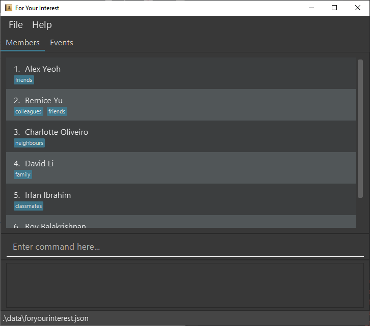

ForYourInterest is a **desktop app for managing members in university clubs/societies, optimized for use via a Command Line Interface** (CLI) while still having the benefits of a Graphical User Interface (GUI). If you can type fast, ForYourInterest can get your member management tasks done faster than traditional GUI apps.

* Table of Contents
{:toc}

--------------------------------------------------------------------------------------------------------------------

## Quick start

1. Ensure you have Java `11` or above installed in your Computer.

1. Download the latest `foryourinterest.jar` from [here](https://github.com/AY2122S1-CS2103-T16-4/tp/releases).

1. Copy the file to the folder you want to use as the _home folder_ for your ForYourInterest.

1. Double-click the file to start the app. The GUI similar to the below should appear in a few seconds. Note how the app contains some sample data.<br>
   

1. Type the command in the command box and press Enter to execute it. e.g. typing **`help`** and pressing Enter will open the help window.<br>
   Some example commands you can try:

   * **`list`** : View all members.

   * **`add`**`n/John Doe p/98765432 e/johnd@example.com a/John street, block 123, #01-01` : Adds a contact named `John Doe` to the Address Book.

   * **`delete`**`3` : Deletes the 3rd contact shown in the current list.

   * **`clear`**`ALL ENTRIES` : Deletes all contacts.

   * **`exit`** : Exits the app.

1. Refer to the [Features](#features) below for details of each command.

--------------------------------------------------------------------------------------------------------------------

## Features

<div markdown="block" class="alert alert-info">

**:information_source: Notes about the command format:**<br>

* Words in `UPPER_CASE` are the parameters to be supplied by the user.<br>
  e.g. in `add n/NAME`, `NAME` is a parameter which can be used as `add n/John Doe`.

* Items in square brackets are optional.<br>
  e.g `n/NAME [t/TAG]` can be used as `n/John Doe t/friend` or as `n/John Doe`.

* Items with `…`​ after them can be used multiple times including zero times.<br>
  e.g. `[t/TAG]…​` can be used as ` ` (i.e. 0 times), `t/friend`, `t/friend t/family` etc.

* Parameters can be in any order.<br>
  e.g. if the command specifies `n/NAME p/PHONE_NUMBER`, `p/PHONE_NUMBER n/NAME` is also acceptable.

* If a parameter is expected only once in the command but you specified it multiple times, only the last occurrence of the parameter will be taken.<br>
  e.g. if you specify `p/12341234 p/56785678`, only `p/56785678` will be taken.

* Extraneous parameters for commands that do not take in parameters (such as `help`, `list`, `exit` and `clear`) will be ignored.<br>
  e.g. if the command specifies `help 123`, it will be interpreted as `help`.

</div>

### Viewing help : `help`

Shows a message explaining how to access the help page.


Format: `help`

### Adding a person: `add`

Adds a member to the Interest Group.

Format: `add n/NAME [p/PHONE_NUMBER] [t/TELEGRAM_HANDLE] [e/EMAIL] [t/TAG]`

* Only member's name must be entered to add the member. All other details are optional.

Examples:
* `add n/Xiao Ming p/61234567 t/@xiao_ming e/xiaoming@gmail.com`
* `add n/John Doe`

### Listing all persons : `list`

Shows the list of all persons in the IG.

Format: `list`

* The list will display the names of all the members in the IG
* The IG leader can click/use the details command with the name to show further details of the member (name, phone number, Telegram handle, Email)

Examples:
* `list` in an IG of 5 members will display all the member’s names.

### Editing a person : `edit`

Edits an existing person in the address book.

Format: `edit INDEX [n/NAME] [p/PHONE] [e/EMAIL] [a/ADDRESS] [t/TAG]…​`

* Edits the person at the specified `INDEX`. The index refers to the index number shown in the displayed person list. The index **must be a positive integer** 1, 2, 3, …​
* At least one of the optional fields must be provided.
* Existing values will be updated to the input values.
* When editing tags, the existing tags of the person will be removed i.e adding of tags is not cumulative.
* You can remove all the person’s tags by typing `t/` without
    specifying any tags after it.

Examples:
*  `edit 1 p/91234567 e/johndoe@example.com` Edits the phone number and email address of the 1st person to be `91234567` and `johndoe@example.com` respectively.
*  `edit 2 n/Betsy Crower t/` Edits the name of the 2nd person to be `Betsy Crower` and clears all existing tags.

### Finding a member: `find`

Finds the members whose details contain any of the given keywords and shows the filtered list of members in the IG. These include their name, mobile number, telegram handle and email.

Format: `find KEYWORD [MORE_KEYWORDS]`

* The search is case-insensitive. E.g `xiaomings` will match `Xiaomings`
* The order of the keywords does not matter. e.g. `Xuan Ming` will match `Ming Xuan`
* The name, mobile number, telegram handle and email will be searched for the keyword.
* Only full words will be matched e.g. `Han` will not match `Hanna`
* Persons matching at least one keyword will be returned (i.e. `OR` search). e.g. `Hanna Bo` will return `Hanna Bana`, `Ling Bo`

Examples:
* `find xuan` returns `Xuan Ming` and `Xuan Xuan`
* `find xiaowen@gmail.com` returns `Xiao Wen`

### Deleting a person : `delete`

Deletes the specified person from the Interest Group

Format: `delete INDEX`

* Deletes the person at the specified `INDEX`.
* The index refers to the index number shown in the displayed person list.
* The index **must be a positive integer** 1, 2, 3, …​

Examples:
* `list` followed by `delete 3` deletes the 3rd person in the displayed person list.
* `find Jason` followed by `delete 1` deletes the 1st person in the results of the `find` command.

### View a person's details : `details`

Shows the detailed view of a particular member in the IG. Typing any command other than the `details` command subsequently will cause the view to show the summarized view of the same person.

Format: `details NAME` or `details INDEX`

* The argument interprets as an `INDEX` if it is a positive integer, `NAME` otherwise.
* Displays the details of the person at the specified `INDEX`.
* The index refers to the index number shown in the displayed person list.
* The index **must be a positive integer** 1, 2, 3, …​
* The NAME entered must match the member’s name exactly (case-sensitive).

Examples:
* `list` followed by `details 3` displays details of the 3rd person in the displayed person list.
* `details Xiao Ming` will output:
  ```
  Xiao Ming details
  61234567
  @xiao_ming
  xiaoming@gmail.com
  ```

* `details John Doe` will output:
  ```
  John Doe details
  NIL
  NIL
  NIL
  ```

### Clearing all entries : `clear`

Clears all entries from the address book.

Format: `clear ALL ENTRIES`

Examples:
* `clear ALL ENTRIES` will output:
  ```
  All entries in the address book are deleted.
  ```

### Exiting the program : `exit`

Exits the program.

Format: `exit`

### Chaining commands : '&&'

Chains multiple commands together.

Format: `COMMAND && COMMAND`

Examples:
* `find Jon && delete 1` will:

Execute `find Jon` and then execute `delete 1`

### Saving the data

AddressBook data are saved in the hard disk automatically after any command that changes the data. There is no need to save manually.

### Editing the data file

AddressBook data are saved as a JSON file `[JAR file location]/data/addressbook.json`. Advanced users are welcome to update data directly by editing that data file.

<div markdown="span" class="alert alert-warning">:exclamation: **Caution:**
If your changes to the data file makes its format invalid, AddressBook will discard all data and start with an empty data file at the next run.
</div>

### Archiving data files `[coming in v2.0]`

_Details coming soon ..._

--------------------------------------------------------------------------------------------------------------------

## FAQ

**Q**: How do I transfer my data to another Computer?<br>
**A**: Install the app in the other computer and overwrite the empty data file it creates with the file that contains the data of your previous AddressBook home folder.

--------------------------------------------------------------------------------------------------------------------

## Command summary

Action | Format, Examples
--------|------------------
**Add** | `add n/NAME p/PHONE_NUMBER e/EMAIL a/ADDRESS [t/TAG]…​` <br> e.g., `add n/James Ho p/22224444 e/jamesho@example.com a/123, Clementi Rd, 1234665 t/friend t/colleague`
**Clear** | `clear ALL ENTRIES`
**Delete** | `delete INDEX`<br> e.g., `delete 3`
**Edit** | `edit INDEX [n/NAME] [p/PHONE_NUMBER] [e/EMAIL] [a/ADDRESS] [t/TAG]…​`<br> e.g.,`edit 2 n/James Lee e/jameslee@example.com`
**Find** | `find KEYWORD [MORE_KEYWORDS]`<br> e.g., `find James Jake`
**List** | `list`
**Help** | `help`
